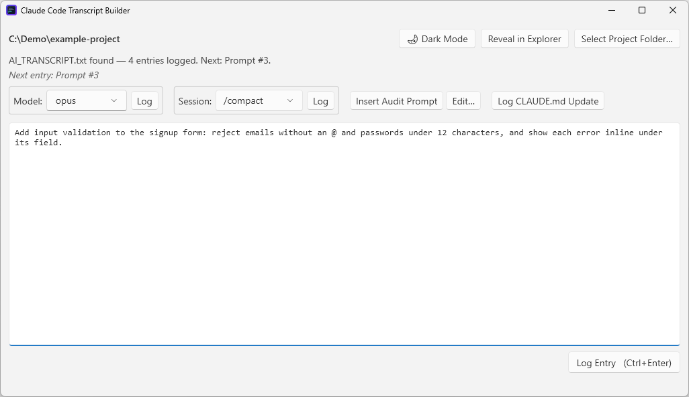
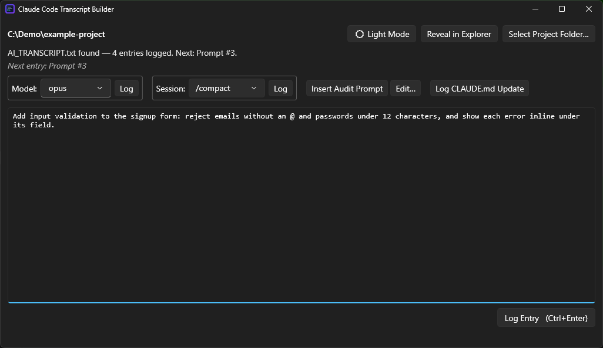

# 📝 Claude Code Transcript Builder

[](https://github.com/mkim87404/claude-code-transcript-builder/actions/workflows/ci.yml)
[](https://github.com/mkim87404/claude-code-transcript-builder/releases/latest)


A standalone Windows desktop app that keeps a verbatim, chronologically-ordered record of every prompt
you type into Claude Code — without spending tokens or asking the assistant to maintain a log itself.

<p>
  
  
</p>

## Contents
- [Overview](#-overview)
- [Features](#-features)
- [Getting started](#-getting-started)
- [Usage](#-usage)
- [AI_TRANSCRIPT.txt format](#-ai_transcripttxt-format)
- [Project structure](#-project-structure)
- [Running the tests](#-running-the-tests)
- [Known limitations](#-known-limitations)
- [Roadmap](#-roadmap)
- [Contributing](#-contributing)
- [License](#-license)

## 🔍 Overview

Keeping a record of the prompts you gave an AI assistant is genuinely useful — for reconstructing why a
design went the way it did, for writing up work afterwards, and for auditing what was actually asked. The
obvious approach, telling the assistant to append each prompt to a file via `CLAUDE.md`, costs tokens on
every single turn and degrades as the session grows.

This app moves that job out of the conversation entirely. You paste each prompt into it before sending
the prompt to Claude Code; it appends the text verbatim to `AI_TRANSCRIPT.txt` in the project root and
puts it straight back on your clipboard, so the extra step costs one keystroke. It runs fully offline,
talks to no network or service, and reads and writes nothing but local files. Composing there first also
means Enter just starts a new line instead of submitting anything — draft a longer prompt without the
usual worry, typing straight into a terminal, of firing it off half-finished.

**Why not just use Claude Code's own session history?** It exists, but it isn't a project record:
- **It expires.** Claude Code deletes session transcripts after 30 days by default (`cleanupPeriodDays`).
- **It's fragmented.** Each session is a separate JSONL file (a new one after every `/clear`), stored on one
  machine, outside the project.
- **It's noisy.** Your prompts are interleaved with tool calls, tool output and system messages.

This app keeps one continuous, plain-text record per project that lives with the code it explains and can
be committed alongside it — including which `CLAUDE.md` was in force at each point, and every model
switch and compaction, in order.

## ✨ Features

- **Verbatim logging** — every prompt stored exactly as written, under a numbered, dual-timestamped heading (UTC + your machine's own local time, auto-detected, DST-aware).
- **Dark mode** — a toggle in the top bar switches the whole app, including the window chrome, between light and dark. Defaults to light; your choice is remembered across launches.
- **Window size remembered** — resize the window however suits you; it reopens at that size next time. A fresh install (nothing remembered yet) launches wide enough for every top-bar button to sit cleanly on one line.
- **Clipboard hand-off** — logging copies the text back, so the next action is a single paste into the terminal.
- **Resume anywhere** — the next entry number is re-derived from the file on disk, never from app state, so closing, reopening and switching projects are all safe.
- **CLAUDE.md seeding** — a project without a `CLAUDE.md` prompts you for one, copies it in byte-for-byte, and logs it as the first entry.
- **Session Exit markers** — paste Claude Code's `claude --resume <id>` line and it is recognised, normalised and logged without consuming a prompt number.
- **Model logging** — pick or type a model and click **Log** to record it with one click; the app copies the exact `/model <value>` command to switch, and logs the same way whether it's your first model for the session or a later switch. The combo box is pre-filled with the last model you logged in any project, and if it hasn't been logged yet for a fresh project you'll see a status nudge and a brief one-off highlight on its **Log** button before your first prompt — never a block, and both clear themselves for good the moment you log one or move past that first prompt.
- **Session commands** — `/compact` and `/clear` are exact, argument-free Claude Code commands, so picking one and clicking **Log** logs it with a single click and copies it to the clipboard, the same way Model logging does. The same combo box leaves room for Claude Code adding more commands worth a shortcut later, without needing more window space.
- **Saved audit prompt** — a long session inevitably drifts from `CLAUDE.md`'s rules as context grows and gets summarised (compacted or cleared — see Session commands above), so one button inserts a CLAUDE.md-compliance audit prompt into the compose box (optionally scoped to an area you fill in), ready to review and log like any other prompt whenever you want to check in. **Edit…** lets you rewrite the saved wording to your own taste — the default is only a starting point, not the only reasonable phrasing.
- **CLAUDE.md Update logging** — re-logs CLAUDE.md's current content under its own heading after you edit it, skipping the write if nothing's actually changed since the last time it was logged.
- **Reveal in Explorer** — opens a File Explorer window with `AI_TRANSCRIPT.txt` pre-selected, once it exists, without depending on whatever (if anything) is set as your default `.txt` handler.
- **Safe with messy files** — unrecognised existing content is preserved and separated; whitespace-only files are cleaned; prompt text that looks like a heading is never mistaken for one.
- **Crash-safe writes** — each entry is a single flushed append with no file handle held between actions.

## 🚀 Getting started

### Option 1: Download the app

Download [`ClaudeCodeTranscriptBuilder-win-x64.exe`](https://github.com/mkim87404/claude-code-transcript-builder/releases/latest/download/ClaudeCodeTranscriptBuilder-win-x64.exe)
from the [latest release](https://github.com/mkim87404/claude-code-transcript-builder/releases/latest) and
run it. It's a single self-contained file for Windows 10/11 x64 — no .NET install and no installer needed.

The exe is **not code-signed**, so Windows SmartScreen may warn that it's from an unknown publisher the
first time you run it. Click **More info → Run anyway** to start it. If you'd rather not run an unsigned
binary, build it from source instead (Option 2).

### Option 2: Build from source

Requires the free [.NET 10 SDK](https://dotnet.microsoft.com/download/dotnet/10.0) (current LTS) on
Windows. The app and core library use only the .NET base class library and WPF; the sole NuGet
dependency is `MSTest`, in the test project. The `.csproj` files are the dependency manifests.

```
git clone https://github.com/mkim87404/claude-code-transcript-builder.git
cd claude-code-transcript-builder
dotnet build TranscriptBuilder.slnx
dotnet run --project TranscriptBuilder
```

To produce the same single-file exe as the release:
```
dotnet publish TranscriptBuilder -c Release -r win-x64 --self-contained true -p:PublishSingleFile=true -p:IncludeNativeLibrariesForSelfExtract=true -p:EnableCompressionInSingleFile=true -p:DebugType=embedded -o publish
```

No configuration or environment variables are needed. The last project you opened and the last
`CLAUDE.md` you copied, along with your last model, theme, custom audit prompt and window size, are
remembered in `settings.json` under `%AppData%\TranscriptBuilder`.

## 📖 Usage

1. Launch the app alongside VS Code. It reopens the last project you pointed it at, in whichever
   theme you last left it in (**🌙 Dark Mode** / **☀️ Light Mode**, top right — light by default).
2. Click **Select Project Folder…** and pick a project's root directory.
   - If `CLAUDE.md` exists at that root and `AI_TRANSCRIPT.txt` doesn't exist yet (or is empty), it is
     read and logged automatically as the first entry — no action needed.
   - If `CLAUDE.md` is missing from the root, a native file picker opens (preselecting the last
     CLAUDE.md you used). The chosen file is copied byte-for-byte into the root as `CLAUDE.md`, and
     logged as the first entry if the transcript still needs one. Cancelling falls back to pasting it
     as the first entry, which is then also written to the root as `CLAUDE.md` (never overwriting).
     For a project whose transcript already has entries, cancelling simply proceeds; nothing is created.
   - If `AI_TRANSCRIPT.txt` already has entries, the app resumes numbering at the correct next `Prompt #N`.
3. Type or paste your next Claude Code prompt into the compose box.
4. Click **Log Entry** (or `Ctrl+Enter`). This appends a numbered, dual-timestamped entry to
   `AI_TRANSCRIPT.txt` and copies the exact text back to the clipboard.
5. Switch to the VS Code terminal and paste (`Ctrl+V`) to continue with Claude Code.
6. When you exit Claude Code, copy its `claude --resume <session-id>` line and paste it into the compose
   box. The app detects it (the "Next entry" label changes to **Session Exit**), and **Log Entry** appends
   a `Session Exit` entry and copies the command back to the clipboard so you can resume immediately.
   Only a paste that is *entirely* the resume line is treated this way; anything else is a normal prompt.
7. To log the model you're on — at session start or after switching — pick or type it in the Model
   combo box (aliases like `opus`, `sonnet`, `haiku`, or a full ID) and click its **Log**. This logs a
   `Model` entry immediately (no prompt number consumed) and copies the exact `/model <value>` command
   to the clipboard, ready to paste into the terminal. The box is pre-filled with whatever you last set
   in any project — confirm it or change it, no need to know the current model yourself. Skipping this
   entirely is fine; if you haven't logged one yet before your first prompt, the status line says so,
   and the reminder goes away on its own once you either log one or move past that first prompt.
8. To log a `/compact` or `/clear`, pick it in the Session combo box and click **Log** — this logs the
   entry immediately (no prompt number consumed) and copies the exact command to the clipboard, ready
   to paste into the terminal, the same way Model logging does.
9. To run a CLAUDE.md compliance audit, click **Insert Audit Prompt**. It inserts the saved audit prompt
   into the compose box — appended after a blank line if you already had a draft there — with a
   `Limit this to <area>` line beneath it, the whole line pre-selected: press **Backspace** to drop it
   entirely, or **→** once to land right after `<area>` and edit it in. Then log it exactly like any
   other prompt. Click **Edit…** beside it to rewrite the saved prompt to your own wording, or
   **Reset to Default** to go back to the built-in one.
10. After editing CLAUDE.md, click **Log CLAUDE.md Update** to re-log its current content under its own
    heading. If nothing's changed since it was last logged, nothing is written. This, Insert Audit Prompt,
    and Edit… are only enabled once CLAUDE.md has already been logged once for the project.
11. Click **Reveal in Explorer** (top bar) at any point after the first entry is logged to jump straight
    to `AI_TRANSCRIPT.txt` in a File Explorer window, pre-selected.

Closing and reopening the app, or pointing it at a different project, is always safe — the next-entry
state is re-derived from `AI_TRANSCRIPT.txt` on disk, never from in-memory app state.

> [!NOTE]
> **Publishing a project publicly?** `AI_TRANSCRIPT.txt` contains your full prompt history. Add it to that
> project's `.gitignore` if you don't want your prompts published along with the code.

## 🧾 AI_TRANSCRIPT.txt format
```
================================================================================
CLAUDE.md                (or "Prompt #<N>")
UTC: 2026-09-19T14:35:42Z
Local: 2026-09-20 02:35:42 +13:00     (your machine's own zone and offset, auto-detected)
================================================================================
<verbatim entry text>

```
Session exits use the heading `Session Exit` (no number, so prompt numbering is unaffected) and a
normalized body: `claude --resume <session-id>`. `Model`, `Compact`, `Clear`, and `CLAUDE.md Update`
entries follow the same non-numbered pattern — a `Model` body is the exact `/model <value>` command, a
`Compact`/`Clear` body is the exact `/compact`/`/clear` command, and a `CLAUDE.md Update` body is the
file's full current content, same as the original `CLAUDE.md` entry.

## 🗂 Project structure
```
TranscriptBuilder.slnx            Solution (app, core library, tests)
TranscriptBuilder/                WPF app (net10.0-windows): UI only
  App.xaml(.cs)                   Application entry point: applies the saved theme, global crash/exception logging
  MainWindow.xaml(.cs)            Main window: project picker, compose box, logging, status
  EditAuditPromptWindow.xaml(.cs) Modal editor for the saved audit-prompt text
  TitleBarTheme.cs                Matches each window's native title bar to the light/dark theme
  Assets/app.ico                  App/window icon (multi-resolution, 16-256px)
TranscriptBuilder.Core/           UI-free logic (net10.0), referenced by the app and the tests
  Models/
    SessionState.cs               Next entry kind/number, entry count + state transitions
    EntryHeadings.cs              Single source of truth for entry heading text
    AppSettings.cs                Everything remembered between launches (project, CLAUDE.md source, model, theme, …)
    AppThemePreference.cs         Light/Dark, independent of WPF's own System.Windows.ThemeMode
    AuditPrompt.cs                The saved CLAUDE.md-audit prompt text and its area placeholder
  Services/
    TranscriptService.cs          Inspect/resume from AI_TRANSCRIPT.txt, append entries, detect CLAUDE.md changes
    ClaudeMdService.cs            Read, copy into, and create the project's root CLAUDE.md
    EntryClassifier.cs            Decide whether a paste logs as Prompt, CLAUDE.md, or Session Exit
    SessionMarker.cs              Strict detection/normalization of a pasted `claude --resume <id>` line
    TimestampService.cs           UTC + auto-detected local (DST-aware) timestamp pair for each entry
    ThemePreferenceService.cs     Parses the persisted light/dark preference, and computes a toggle
    WindowSizing.cs               Launch size from the remembered size, the default, and the screen
    SettingsService.cs            Best-effort load/save of settings.json under %AppData%\TranscriptBuilder
TranscriptBuilder.Tests/          MSTest: unit tests for pure helpers + real-filesystem integration tests
.github/workflows/ci.yml          CI: Release build + tests on every push/PR to main (windows-latest)
tools/                            Standalone helper programs (see tools/README.md)
.github/screenshot-*.png          Light and dark screenshots embedded in this README
LICENSE                           MIT
```

## ✅ Running the tests

```
dotnet test TranscriptBuilder.Tests
```

Unit tests cover the pure helpers (including the exact daylight-saving boundary, against a fixed zone
so the test is deterministic on any machine); integration tests
exercise the real filesystem in temporary folders — first launch, CLAUDE.md copy and paste-create,
resume-from-disk matching in-memory state, messy and hostile transcript content, and handle release.
Tests never build or lock the WPF exe, so they can run while the app is open.

## ⚠️ Known limitations

- **Windows only.** WPF; there is no macOS or Linux build.
- **Dark mode's native title bar needs Windows 11 (Build 22000+).** The rest of dark mode works on older Windows 10 builds too; only the title bar itself stays the default color there.
- **A `/clear` mid-session hides a session ID** — it never appears in an exit line, so it can't be captured as a Session Exit marker.
- **The window itself has no automated tests.** Dialogs, clipboard and label rendering are verified manually; the UI layer is deliberately thin.
- **Logged resume commands expire.** Claude Code keeps session transcripts for 30 days by default, so older markers may no longer resolve.

## 🛣 Roadmap

- Automated coverage for the UI layer (picker, clipboard, status rendering).
- Optional exclusion of `AI_TRANSCRIPT.txt` from version control, for projects published publicly.
- Code-signing the release exe, so SmartScreen stops warning on first run. The downloadable binary and the build+test CI workflow shipped with v1.0.0.
- No `/rewind` shortcut, deliberately: unlike `/compact` and `/clear`, it opens an interactive checkpoint picker rather than completing as one fixed command, so it doesn't fit the one-click "log and copy the exact command" pattern Session commands uses without its own separate design.

## 🤝 Contributing

Issues and pull requests are welcome. Before opening a PR, make sure `dotnet build TranscriptBuilder.slnx`
finishes with no warnings and `dotnet test TranscriptBuilder.Tests` passes, and add tests alongside any
new logic — the pure parts belong in `TranscriptBuilder.Core`, where they can be tested without the UI.
`NOTES.md` records why things are the way they are; it's worth a skim before changing established behavior.

## ⚖️ License

[MIT](LICENSE)

---

See `NOTES.md` for the architectural decisions and trade-offs behind this design.
